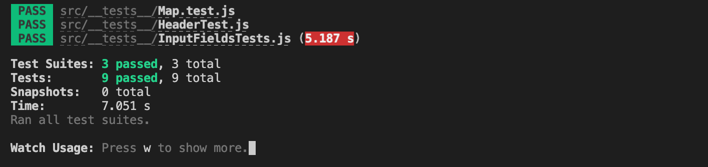
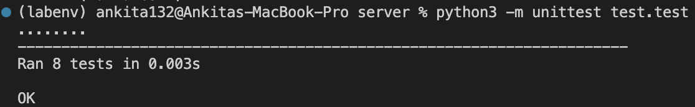

# ELeNA : Elevation based Navigation

## ELeNA
Elevation-based Navigation (EleNa) is a map based application that gives the user a preferred route between any two points on the map that either minimizes or maximizes the elevation gain and is within “x%” of the shortest path possible where x is user specified.

## Web Application
* The web application follows the client-server architecture. 
* The frontend of the application is built on ReactJs and is rendered at `http://localhost:3000`.

* The web server (backend) for the application is built on Python (majorly Flask) and is served at `http://localhost:5000`.

* We have followed MVC architecture for building the backend of the application.

* Path rendered when `No Elevation` is selected.

* Path rendered when `Min Elevation` is selected with 50% of the shortest path.

* Path rendered when `Max Elevation` is selected with 50% of the shortest path.

## How to Run

### Frontend Application
* Ensure the system has node, npm installed.
* Move to the project's frontend directory. 
`cd ./src/client/`
* Install the required dependencies. 
`npm install`
* Run the react web app. 
`npm start`

### Backend Application
* Ensure python is installed on the system, and the python version is >=3.10
* Move to the project's backend directory. 
`cd ./src/server/src`
* (Optional) Instead of installing the packages on the system, we can make a virtual environment and install the packages. 
`python -m venv virtual_env`
* Enter the virtual environment. 
`source virtual_env/bin/activate`
* Install the required packages. 
`pip install -r requirements.txt`
* Run the flask server. 
`python app.py`

### Testing 
#### Frontend Testing

* Move to the project's frontend directory. 
`cd ./src/client/`

* Run the following commands to run jest tests. 
`npm test` 
> Enter a to run all the tests.

#### Backend Testing

* Move to the project's backend directory. 
`cd ./src/server/src`

* Run the following commands to run junit tests. 
`python3 -m unittest test.test`

